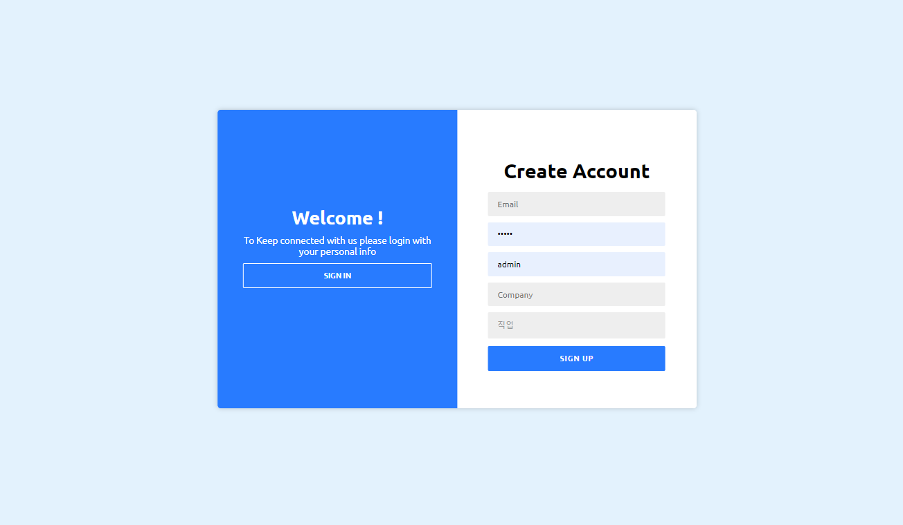
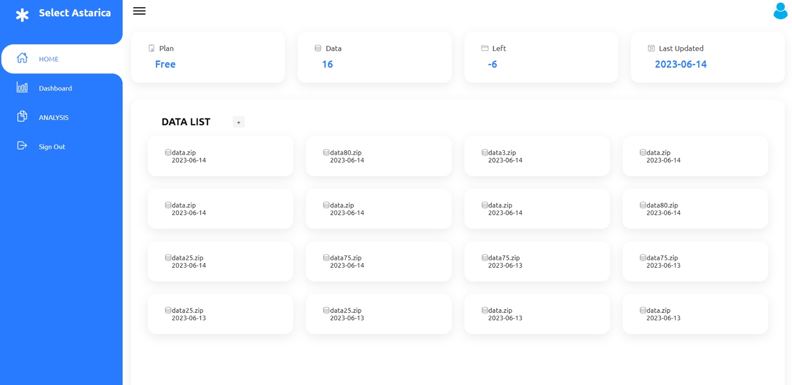
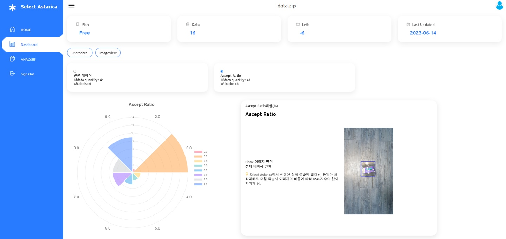
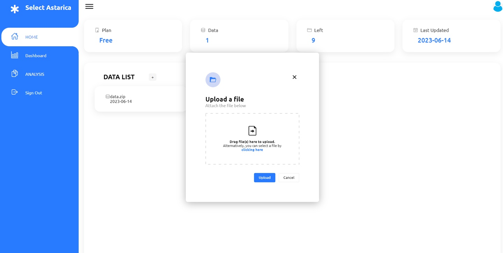
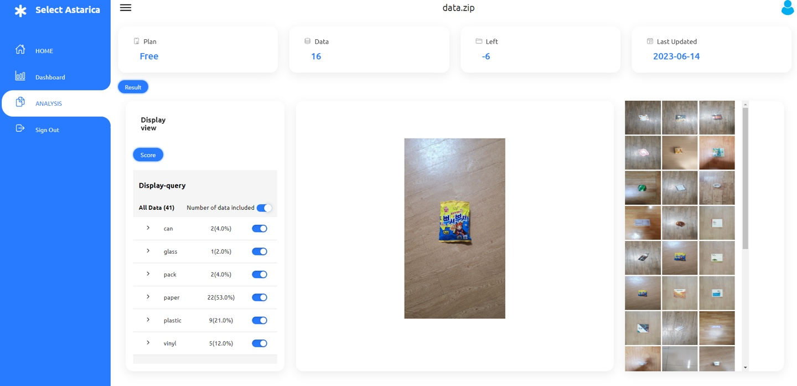

# Select-Astarica

DataSet Dashboard, Analysis

    <h1>라벨링 영역 비율 기반 평가지표를 활용한  이미지 데이터셋 품질 평가 서비스</h1>

    <ul>
      <li>MVC패턴을 이용한 Web Service</li>
      <li>AJAX를 이용한 Flask와 Apache Tomcat과 연동</li>
      <li>Mybatis와 hikaricp를 이용한 Mysql 연동</li>
    </ul>

<h4>팀원 소개</h4>
<table>
    <tr>
        <td align="center">
            
        </td>
        <td align="center">
            
        </td>
        <td align="center">
            
        </td>
        <td align="center">
            
        </td>
        <td align="center">
            
        </td>
    </tr>
    <tr>
        <td align="center">
            <a href="https://github.com/rlgus3351">
                권기현
            </a>
        </td>
        <td align="center">
            <a href="https://github.com/so1454">
                구소현
            </a>
        </td>
        <td align="center">
            <a href="https://github.com/vcfrgkap">
                배다경
            </a>
        </td>
        <td align="center">
            <a href="https://github.com/dlpmi99">
                이세미
            </a>
        </td>
        <td align="center">
            <a href="https://github.com/webobae">
                최근호
            </a>
        </td>
    </tr>
    <tr>
        <td align="center">
            PM 데이터 전처리 데이터 모델링 이미지 비율 기능 구현
        </td>
        <td align="center">
            Back-end 원본 데이터 차트 시각화 데이터 프레임  비동기 통신 구현
        </td>
        <td align="center">
            Front-end 데이터 시각화 화면 구현 데이터셋 점수 페이지 
        </td>
        <td align="center">
            Front-end 데이터 옵션 선택창 리스트 업로드 페이지 
        </td>
        <td align="center">
            Back-end Bbox 영역 차트화 파일 업로드 기능  파일 다운로드 기능
        </td>
    </tr>

</table>

 
  <h3>🛠 기술 스택</h3>
  <h4>Back-end</h4>
     
    
     
    
    
    
  <h4>Front-end</h4>
     
     
     
  <h4>DataBase</h4>
    
  <h4>ML</h4>
     
  <h4>Cooperation</h4>
    

    <h4>기능 소개</h4>
    <table>
        <thead>
            <td align="center">회원가입 & 로그인 화면</td>
            <td align="center">데이터 리스트 화면</td>
        </thead>
        <tbody>
            <td></td>
            <td></td>
        </tbody>
    </table>
    <table>
        <thead>
            <td align="center">클래스 시각화</td>
            <td align="center">Bbox 영역 시각화</td>
        </thead>
        <tbody>
            <td></td>
            <td></td>
        </tbody>
    </table>
    <table>
        <thead>
            <td align="center">이미지 배율 분석</td>
            <td align="center">데이터 업로드 화면</td>
        </thead>
        <tbody>
            <td></td>
            <td></td>
        </tbody>
    </table>
    <table>
        <thead>
            <td align="center">분석 화면</td>
            <td align="center">데이터 평가</td>
        </thead>
        <tbody>
            <td></td>
            <td></td>
        </tbody>
    </table>

<h4>시연 영상</h4>

    

